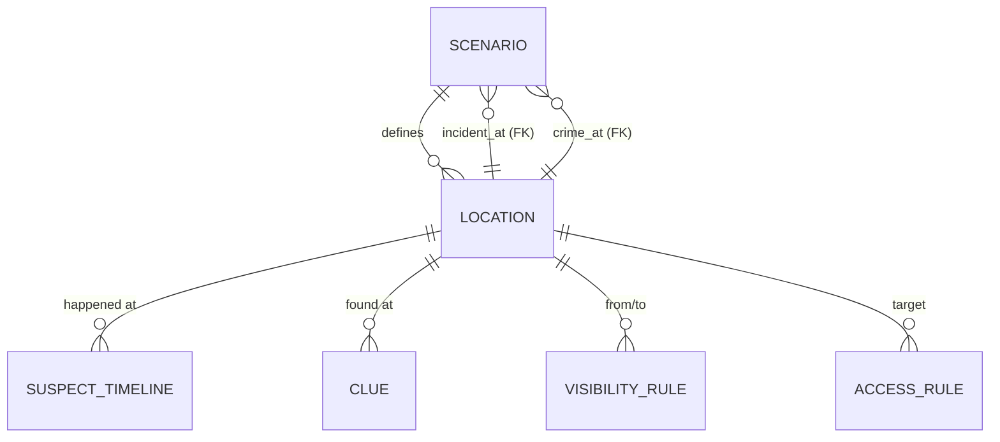
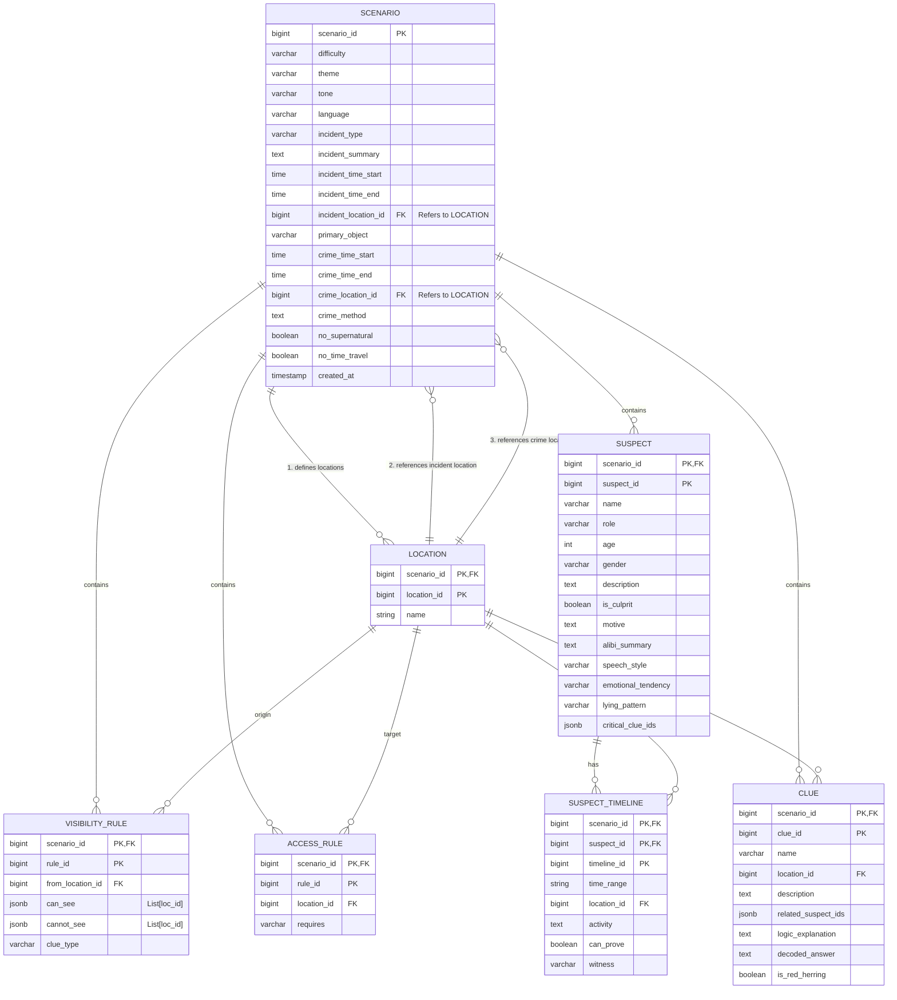

# Location 참조 방식 변경: Name → ID 기반 리팩토링 (Final)

본 문서는 시나리오 내 장소(`Location`) 참조 방식을 기존의 **이름(String) 기반**에서 **ID(BigInteger, Foreign Key) 기반**으로 완전히 전환한 작업 내용을 정리합니다. 특히 `feat/ISSUE-36` 작업을 통해 루트 테이블인 `Scenario`까지 참조 방식이 통일되었습니다.

---

## 1. 개요 및 목적

추리 게임의 특성상 장소 간의 연결성(Visibility), 접근성(Access), 그리고 사건의 핵심 정보(Crime Location)는 데이터 무결성이 매우 중요합니다.

**기존 문제점:**
*   `incident_location`, `crime_location` 등이 문자열로 저장되어 LLM이 미세하게 다른 이름을 뱉을 경우(예: "복도" vs "중앙 복도") 데이터 불일치 발생.
*   DB 레벨에서 존재하지 않는 장소를 참조하는 것을 막을 방법이 없음.

**리팩토링 방향:**
*   **DB 레벨:** 모든 장소 참조를 `BIGINT` 타입의 Foreign Key로 변경하여 무결성 강제.
*   **애플리케이션 레벨:** AI 생성물과의 호환성을 위해 저장 시 **Fuzzy Matching**을 통한 보정 로직 도입.
*   **API 레벨:** 클라이언트는 여전히 직관적인 장소 이름(String)으로 데이터를 주고받음.

---

## 2. 데이터 구조 (ERD)

### 2.1. 단순화된 구조 (Simplified Version)
핵심적인 참조 흐름을 보여줍니다.

### 2.2. 상세 구조 (Detailed Version)
모든 속성과 타입을 포함한 전체 구조입니다.

---

## 3. 핵심 로직 변경 사항

### 3.1. 순환 참조 해결 (Circular Dependency)
*   `Scenario`는 `Location`을 참조하고, `Location`은 `Scenario`를 참조합니다.
*   **해결:** `save_scenario` 시 `Scenario`를 먼저 저장한 뒤, `Location`을 저장하고, 다시 `Scenario`의 `location_id` 컬럼들을 업데이트(`UPDATE`) 하는 방식으로 처리합니다.
*   안전한 외래 키 체크를 위해 `Location` 저장 후 `session.flush()`를 호출하여 DB에 임시 반영합니다.

### 3.2. AI 환각 방지 (Fuzzy Matching & Fallback)
LLM이 정의되지 않은 장소 이름을 사용할 경우를 대비해 `ScenarioRepository`에 보정 로직을 추가했습니다.

1.  **Exact Match**: 이름이 정확히 일치하면 해당 ID 사용.
2.  **Partial Match**: "학교 본관 도서관"과 "도서관"처럼 포함 관계가 성립하면 기존 장소로 매핑.
3.  **Fallback**: 위 방법으로도 찾을 수 없으면 시나리오의 첫 번째 장소(보통 로비나 거실)로 강제 매핑하여 데이터 유실 및 에러 방지.

### 3.3. 타입 안정성 (BigInteger)
*   모든 PK, FK 컬럼에 `BigInteger`를 적용하여 대규모 데이터셋 처리 및 DB 스키마와의 정밀한 타입 일치를 구현했습니다.

---

## 4. 기대 효과

*   **참조 무결성**: DB 수준에서 존재하지 않는 장소를 참조하는 시도를 원천 차단.
*   **유연한 UI/AI 연동**: 내부적으로는 안전한 ID를 쓰지만, 인터페이스는 직관적인 이름을 유지.
*   **확장성**: 추후 장소 이름이 변경되거나 다국어 처리가 필요할 때 중심부(Scenario, Clue 등) 수정 없이 `Location` 테이블만 관리하면 됨.