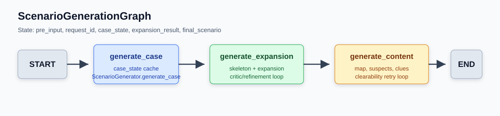
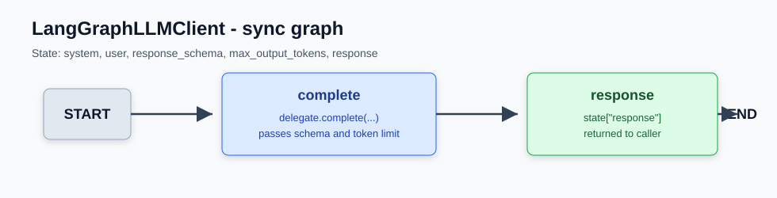
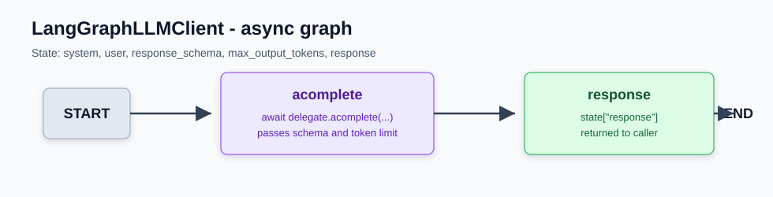

# LangGraph Workflow

이 문서는 현재 서버에서 LangGraph가 적용된 워크플로를 설명한다. 구현은 크게 두 층이다.

- 시나리오 생성 전체 흐름을 오케스트레이션하는 `ScenarioGenerationGraph`
- 모든 LLM `complete` / `acomplete` 호출을 감싸는 `LangGraphLLMClient`

기존 Gemini 호출, 프롬프트, response schema, JSON 파싱, Pydantic 검증, 중간 상태 저장 정책은 유지한다. LangGraph는 호출 순서와 실행 단위를 명시하는 역할을 맡는다.

## ScenarioGenerationGraph

`ScenarioService.generate()`는 직접 순차 실행하지 않고 `ScenarioGenerationGraph.invoke()`를 호출한다. 그래프 입력 상태는 `pre_input`, `request_id`이며, 실행 결과로 `final_scenario`를 반환한다.

### 1. generate_case

`generate_case` 노드는 `case_state`를 만든다.

- `ScenarioStateManager`에 저장된 `case_state`가 있으면 재사용한다.
- 없으면 `ScenarioGenerator.generate_case()`를 호출한다.
- 새로 생성한 경우 기존 정책대로 rate-limit 완화를 위해 sleep을 수행한다.

### 2. generate_expansion

`generate_expansion` 노드는 사건 개요를 기반으로 시나리오 확장을 생성하고 critic 검증을 수행한다.

- skeleton과 expansion 중간 산출물을 로드하거나 생성한다.
- unified critic으로 expansion을 평가한다.
- critic 피드백이 expansion 수준이면 expansion을 다시 생성한다.
- critic 피드백이 skeleton 수준이면 skeleton부터 다시 생성한다.
- 재시도 한도를 넘으면 마지막 expansion을 fallback으로 사용한다.

### 3. generate_content

`generate_content` 노드는 최종 플레이 가능 시나리오를 조립한다.

- map skeleton을 생성한다.
- suspect 목록을 생성하고 `fact_id`를 순차 주입한다.
- clue 목록을 생성한다.
- furniture와 map detail을 생성한다.
- `ScenarioResult`를 조립한다.
- clearability 평가에 실패하면 suspect와 clue를 피드백 기반으로 다시 생성한다.

## LangGraphLLMClient Sync Graph

동기 LLM 호출은 `LangGraphLLMClient.complete()`를 통해 실행된다. 내부 그래프는 단일 `complete` 노드를 가진다.

### 입력 상태

- `system`: 시스템 프롬프트
- `user`: 사용자 입력
- `response_schema`: 구조화 출력 schema
- `max_output_tokens`: 호출별 토큰 제한

### complete 노드

`complete` 노드는 delegate LLM 클라이언트의 `complete()`를 호출한다. 현재 기본 delegate는 `GeminiClient`다.

이 노드는 입력받은 `response_schema`와 `max_output_tokens`를 그대로 전달한다. 따라서 기존 구조화 출력, Gemini schema sanitizing, quota retry 로직은 delegate에 남아 있다.

### 출력 상태

delegate 응답 문자열은 `response`에 저장되고, `LangGraphLLMClient.complete()`의 반환값이 된다.

## LangGraphLLMClient Async Graph

비동기 LLM 호출은 `LangGraphLLMClient.acomplete()`를 통해 실행된다. 그래프 구조는 동기 그래프와 같지만 노드는 `acomplete`이며 delegate의 `acomplete()`를 await한다.

### 사용 위치

비동기 그래프는 현재 대화형 기능에서 주로 사용된다.

- 용의자 응답 생성
- 형사 일반 채팅
- 비동기 pressure 평가

## 적용 범위

다음 경로는 `ensure_langgraph_llm_client()`를 통해 LLM 클라이언트를 LangGraph 래퍼로 통일한다.

- FastAPI dependency: chat, scenario, solve service 생성
- scenario generation service
- solve service와 solve validator
- suspect, clue, detective chat agents
- pressure judge
- scenario, suspect, clue, map generator 계층
- critic evaluator와 scenario refiner
- clearability evaluator

이미 `LangGraphLLMClient`인 클라이언트는 다시 감싸지 않는다. 이 덕분에 service와 agent 양쪽에서 방어적으로 래핑해도 중복 그래프가 생기지 않는다.

## 검증 기준

현재 테스트는 외부 LLM, DB, Redis, embedding 모델 없이 그래프 연결만 검증한다.

- `test_scenario_generation_graph.py`: 시나리오 그래프 노드 실행 순서 검증
- `test_langgraph_client.py`: 동기/비동기 LLM 그래프 위임, schema 전달, 중복 래핑 방지 검증

전체 시나리오 생성 품질은 기존 프롬프트와 schema 동작에 의존한다. 따라서 prompt나 schema 변경 없이 LangGraph 적용 범위를 바꿀 때는 우선 이 문서의 그래프 구조와 테스트를 함께 갱신한다.
